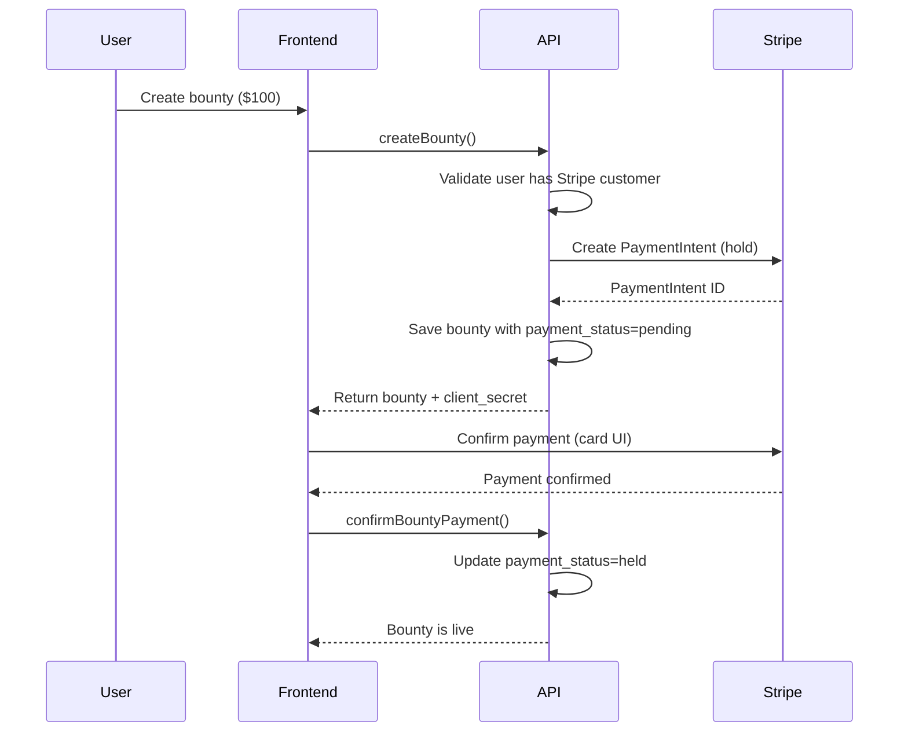
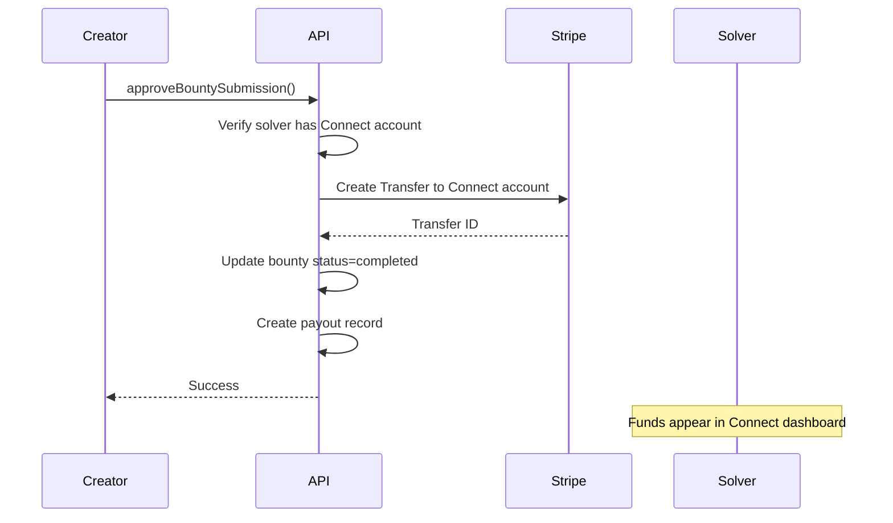

# Stripe Payments Integration Plan

## Current State

- **Pro Subscriptions**: Polar SDK integrated in [auth/src/server.ts](auth/src/server.ts) with better-auth plugin
- **Bounty Schema**: Has `amount`/`currency` fields but no payment processing - [db/src/schema/bounties.ts](db/src/schema/bounties.ts)
- **Payment Settings**: UI placeholder exists at [web/apps/web/src/components/settings/payment-settings.tsx](web/apps/web/src/components/settings/payment-settings.tsx) - says "not yet implemented"
- **Billing Router**: Only handles Polar customer creation - [api/src/routers/billing.ts](api/src/routers/billing.ts)

---

# 🔷 PART 1: Stripe Connect for Bounty Payments

This part implements the core payment infrastructure for bounties - holding funds when bounties are created and paying out solvers when work is approved.

---

## Phase 1.1: Database Schema Changes

Add payment-related columns and tables to the database:

### User Table Extensions

- `stripeCustomerId` - For charging bounty creators
- `stripeConnectAccountId` - For paying out bounty solvers
- `stripeConnectOnboardingComplete` - Boolean flag

### Bounty Table Extensions  

- `stripePaymentIntentId` - The held payment
- `stripeTransferId` - The payout transfer (after completion)
- `paymentStatus` - Enum: `pending`, `held`, `released`, `refunded`, `failed`

### New Tables

- `transaction` - Audit log of all money movement (bounty_id, type, amount, stripe_id, created_at)
- `payout` - Track solver payouts (user_id, bounty_id, amount, status, stripe_transfer_id)

Files to modify:

- [db/src/schema/auth.ts](db/src/schema/auth.ts) - Add Stripe fields to user
- [db/src/schema/bounties.ts](db/src/schema/bounties.ts) - Add payment fields
- New file: `db/src/schema/payments.ts` - Transaction and payout tables

---

## Phase 1.2: Stripe Integration Package

Create a new `stripe/` package in the monorepo for Stripe utilities:

```
stripe/
├── src/
│   ├── client.ts          # Stripe SDK instance
│   ├── connect.ts         # Connect account management
│   ├── payments.ts        # Payment intents, transfers
│   ├── webhooks.ts        # Webhook handlers
│   └── index.ts
├── package.json
└── tsconfig.json
```

Key functions:

- `createPaymentIntent(amount, currency, customerId, bountyId)` - Hold funds
- `capturePayment(paymentIntentId)` - Release to platform
- `createTransfer(amount, connectAccountId, bountyId)` - Pay solver
- `createConnectAccountLink(userId)` - Onboarding URL
- `handleWebhook(payload, signature)` - Process Stripe events

### Environment Variables (Part 1)

Add to [env/src/server.ts](env/src/server.ts):

```
STRIPE_SECRET_KEY=sk_...           # For Connect (bounty payouts)
STRIPE_PUBLISHABLE_KEY=pk_...      # For frontend Stripe Elements
STRIPE_CONNECT_WEBHOOK_SECRET=whsec_...  # For Connect webhooks
```

---

## Phase 1.3: Bounty Payment Flow

### Creating a Bounty (Escrow)



### Completing a Bounty (Payout)



### API Router Changes

Update [api/src/routers/bounties.ts](api/src/routers/bounties.ts):

- `createBounty` - Create PaymentIntent, return client_secret
- `confirmBountyPayment` - Mark payment as held after Stripe confirmation
- `approveBountySubmission` - Trigger transfer to solver
- `cancelBounty` - Refund held payment
- `getBountyPaymentStatus` - Check payment state

---

## Phase 1.4: Stripe Connect Onboarding

### Settings Page Integration

Update [web/apps/web/src/components/settings/payment-settings.tsx](web/apps/web/src/components/settings/payment-settings.tsx):

- Show Connect account status (not connected / pending / active)
- "Connect with Stripe" button -> Stripe Connect OAuth flow
- Display payout balance and history when connected
- Link to Stripe Express Dashboard

### Contextual Prompting

When a user tries to submit work on a bounty:

1. Check if they have a connected Stripe account
2. If not, show modal: "To receive payouts, connect your Stripe account"
3. Redirect to Stripe Connect onboarding
4. Return to submission flow after completion

### UX Best Practices for Connect Onboarding

Based on successful marketplace platforms (Upwork, Fiverr, GitHub Sponsors):

**Timing**:

- Don't require Connect during signup - friction kills conversion
- Prompt at the "moment of value" (when they're about to earn money)
- Allow browsing/applying to bounties without Connect

**Messaging**:

- Frame it as "Set up payouts" not "Connect Stripe account"
- Show estimated earnings: "You're about to earn $100 - set up payouts to receive it"
- Explain the ~2 min process: "Quick identity verification"

**Flow**:

```
[Submit Bounty Work] 
    → Check Connect status
    → If not connected: Show modal
        "🎉 You're about to earn $100!"
        "Set up payouts to receive your bounty reward"
        [Continue to Payout Setup] [I'll do this later]
    → Stripe Connect Express onboarding (hosted by Stripe)
    → Return to bounty with submission confirmed
```

**Settings Page**:

- Show clear status: "Not connected" / "Pending verification" / "Ready to receive payouts"
- Display total earnings and pending payouts
- Link to Stripe Express Dashboard for payout history

### Connect Account API

New router: `api/src/routers/connect.ts`

- `getConnectStatus` - Check if user has Connect account
- `createConnectAccountLink` - Generate onboarding URL
- `getConnectDashboardLink` - Link to Express dashboard
- `getPayoutHistory` - List user's received payouts

---

## Phase 1.5: Stripe Connect Webhook Handler

Create webhook endpoint at `web/apps/web/src/app/api/webhooks/stripe/route.ts`.

Handle Connect events:

- `payment_intent.succeeded` - Mark bounty payment as held, bounty goes live
- `payment_intent.payment_failed` - Mark payment failed, notify creator
- `payment_intent.canceled` - Handle user cancellation
- `transfer.created` - Log payout initiated to solver
- `transfer.failed` - Handle failed payout, notify admin
- `account.updated` - Update Connect account onboarding status
- `payout.paid` - Confirm solver received funds in their bank
```typescript
// web/apps/web/src/app/api/webhooks/stripe/route.ts
import Stripe from "stripe";
import { headers } from "next/headers";

const stripe = new Stripe(env.STRIPE_SECRET_KEY);

export async function POST(request: Request) {
  const body = await request.text();
  const signature = headers().get("stripe-signature")!;
  
  const event = stripe.webhooks.constructEvent(
    body,
    signature,
    env.STRIPE_CONNECT_WEBHOOK_SECRET
  );

  switch (event.type) {
    case "payment_intent.succeeded":
      // Update bounty payment_status = "held"
      break;
    case "transfer.created":
      // Log payout in transaction table
      break;
    case "account.updated":
      // Update user's stripeConnectOnboardingComplete
      break;
  }
  
  return Response.json({ received: true });
}
```


---

## Phase 1.6: Frontend Payment UI

### Bounty Creation Flow

Update [web/apps/web/src/components/dashboard/task-input-form.tsx](web/apps/web/src/components/dashboard/task-input-form.tsx):

1. After form submission, show Stripe Elements payment form
2. Use `@stripe/react-stripe-js` for card input
3. Confirm payment before bounty goes live
4. Show "Payment held - Bounty is live!" confirmation

### Bounty Detail Page

- Show payment status badge (Funded / Pending / Completed)
- For creator: Show "Release Payment" when approving submission
- For solver: Show "Payout pending" / "Paid $X" status

### New Components

- `PaymentForm` - Stripe Elements wrapper for card input
- `ConnectOnboardingModal` - Prompt to connect Stripe account
- `PayoutStatusBadge` - Show payout state on bounty cards

---

## Phase 1.7: Dependencies (Part 1)

```bash
# Stripe for Connect (bounty payouts) - direct SDK needed
bun add stripe @stripe/stripe-js @stripe/react-stripe-js
```

| Package | Purpose |

|---------|---------|

| `stripe` | Server-side Stripe SDK for Connect account management and transfers |

| `@stripe/stripe-js` | Client-side Stripe.js loader |

| `@stripe/react-stripe-js` | React components for payment form (Elements) |

---

## Phase 1.8: Testing Part 1

Test the full Connect flow in Stripe test mode:

- [ ] Create a bounty with payment (test card 4242424242424242)
- [ ] Verify funds are held (PaymentIntent in Stripe Dashboard shows "held")
- [ ] Connect a Stripe account as a solver (test onboarding)
- [ ] Approve bounty submission and verify transfer is created
- [ ] Check webhook events are processed correctly
- [ ] Test refund flow for cancelled bounties

---

# 🚧 CHECKPOINT: Part 1 Complete

## ✅ Part 1 Checklist

Before proceeding to Part 2, verify ALL of the following:

### Database & Schema

- [ ] User table has `stripeCustomerId`, `stripeConnectAccountId`, `stripeConnectOnboardingComplete`
- [ ] Bounty table has `stripePaymentIntentId`, `stripeTransferId`, `paymentStatus`
- [ ] `transaction` and `payout` tables exist and are working

### Stripe Connect Integration

- [ ] `stripe/` package created with all utility functions
- [ ] Environment variables configured (STRIPE_SECRET_KEY, STRIPE_PUBLISHABLE_KEY, STRIPE_CONNECT_WEBHOOK_SECRET)
- [ ] Webhook endpoint receives and processes events correctly

### Payment Flows

- [ ] Bounty creation flow holds funds via PaymentIntent
- [ ] Bounty approval triggers transfer to solver's Connect account
- [ ] Refunds work for cancelled bounties

### User Experience

- [ ] Settings > Payments page shows Connect status and allows onboarding
- [ ] Contextual modal prompts solvers to set up payouts when submitting work
- [ ] Payment status badges display correctly on bounty cards

### Testing

- [ ] All flows tested in Stripe test mode
- [ ] Edge cases handled (failed payments, incomplete onboarding, etc.)

---

## ⏸️ STOP HERE

**Do NOT proceed to Part 2 until:**

1. ✅ All checklist items above are complete
2. ✅ User has explicitly agreed to proceed to Part 2

Ask the user: *"Part 1 (Stripe Connect) is complete. Ready to proceed to Part 2 (Migrate Polar to Stripe)?"*

---

# 🔶 PART 2: Migrate Polar to Stripe (Autumn)

> ⚠️ **PREREQUISITE**: Part 1 must be complete and user must verbally agree to proceed.

This part replaces Polar with Autumn (`autumn-js`) for Pro subscription billing. Autumn sits between your app and Stripe, handling subscription state, usage metering, and plan switching - no webhooks needed for subscriptions!

---

## Phase 2.1: Environment Variables

Remove Polar variables from [env/src/server.ts](env/src/server.ts):

```diff
- POLAR_ACCESS_TOKEN
- BOUNTY_PRO_ANNUAL_ID
- BOUNTY_PRO_MONTHLY_ID
- POLAR_SUCCESS_URL
- POLAR_WEBHOOK_SECRET
```

Add Autumn variable:

```
AUTUMN_SECRET_KEY=am_sk_...        # From Autumn dashboard
```

---

## Phase 2.2: Autumn Dashboard Setup

1. Create Free plan (auto-enable) with features: `lower_fees: false`, `concurrent_bounties: 3`
2. Create Pro plan ($20/mo or $200/yr) with features: `lower_fees: true`, `concurrent_bounties: unlimited`

---

## Phase 2.3: Auth Server Changes

Remove Polar plugin from [auth/src/server.ts](auth/src/server.ts):

```diff
- import { checkout, polar, portal, usage, webhooks } from "@polar-sh/better-auth";
- import { Polar } from "@polar-sh/sdk";
```

Autumn doesn't need a better-auth plugin - it works via API routes and React hooks.

---

## Phase 2.4: New API Route - Autumn Handler

Create `web/apps/web/src/app/api/autumn/[...all]/route.ts`:

```typescript
import { autumnHandler } from "autumn-js/next";
import { auth } from "@bountydotnew/auth/server";

export const { GET, POST } = autumnHandler({
  identify: async (request) => {
    const session = await auth.api.getSession({
      headers: request.headers,
    });
    return {
      customerId: session?.user.id,
      customerData: {
        name: session?.user.name,
        email: session?.user.email,
      },
    };
  },
});
```

---

## Phase 2.5: Frontend - Add AutumnProvider

Wrap app in [web/apps/web/src/app/layout.tsx](web/apps/web/src/app/layout.tsx):

```tsx
import { AutumnProvider } from "autumn-js/react";

<AutumnProvider>
  {children}
</AutumnProvider>
```

---

## Phase 2.6: Update Billing UI

Replace `useBilling` hook with Autumn's `useCustomer`:

```tsx
import { useCustomer, CheckoutDialog } from "autumn-js/react";

const { customer, checkout, openBillingPortal } = useCustomer();
const isPro = customer?.products.some(p => p.id === "pro" && p.status === "active");

// Upgrade to Pro
await checkout({ productId: "pro", dialog: CheckoutDialog });

// Open Stripe billing portal
await openBillingPortal({ returnUrl: "/settings/billing" });
```

---

## Phase 2.7: Billing Router Simplification

The [api/src/routers/billing.ts](api/src/routers/billing.ts) can be drastically simplified or removed - Autumn handles customer creation automatically via `useCustomer()` hook. Keep only if you need server-side Pro checks:

```typescript
import { Autumn } from "autumn-js";
const autumn = new Autumn({ secretKey: env.AUTUMN_SECRET_KEY });

// Check if user is Pro
const { data } = await autumn.customers.get(userId);
const isPro = data?.products.some(p => p.id === "pro" && p.status === "active");
```

---

## Phase 2.8: Migration Strategy

### For Existing Users

1. Existing Pro subscribers stay on Polar until renewal
2. New Pro signups go through Autumn/Stripe
3. Gradually migrate Polar subscribers to Stripe

### For Existing Bounties

- Bounties created before payments go live remain "legacy" (no payment attached)
- New bounties require payment to go live

---

## Phase 2.9: Dependencies (Part 2)

```bash
# Autumn for Pro subscriptions (includes Stripe under the hood)
bun add autumn-js
```

| Package | Purpose |

|---------|---------|

| `autumn-js` | Pro subscription billing - handles checkout, usage tracking, billing portal |

---

## Phase 2.10: Testing Part 2

- [ ] New users can subscribe to Pro via Autumn checkout
- [ ] Existing Polar subscriptions continue working
- [ ] Billing portal opens correctly
- [ ] `useCustomer` hook returns correct subscription state
- [ ] Server-side Pro checks work via Autumn SDK

---

# File Summary

## Part 1 Files

### New Files

- `db/src/schema/payments.ts` - Transaction/payout tables
- `stripe/` - New package for Stripe Connect utilities
- `api/src/routers/connect.ts` - Connect account management
- `web/apps/web/src/app/api/webhooks/stripe/route.ts` - Connect webhook handler
- `web/apps/web/src/components/payment/payment-form.tsx` - Stripe Elements for bounty payment
- `web/apps/web/src/components/payment/connect-onboarding-modal.tsx` - "Set up payouts" modal

### Modified Files

- `db/src/schema/auth.ts` - Add `stripeConnectAccountId`, `stripeConnectOnboardingComplete`
- `db/src/schema/bounties.ts` - Add `stripePaymentIntentId`, `paymentStatus`
- `api/src/routers/bounties.ts` - Add payment intent creation, transfer on approval
- `env/src/server.ts` - Add Stripe env vars
- `web/apps/web/src/components/settings/payment-settings.tsx` - Connect onboarding UI
- `web/apps/web/src/components/dashboard/task-input-form.tsx` - Payment flow after bounty creation

## Part 2 Files

### New Files

- `web/apps/web/src/app/api/autumn/[...all]/route.ts` - Autumn handler (Pro subs)

### Modified Files

- `auth/src/server.ts` - Remove Polar plugin entirely
- `api/src/routers/billing.ts` - Simplify (Autumn handles most logic via hooks)
- `env/src/server.ts` - Remove Polar vars, add Autumn var
- `types/src/billing.ts` - Update types for Autumn customer state
- `web/apps/web/src/app/layout.tsx` - Add `<AutumnProvider>`
- `web/apps/web/src/components/settings/billing-settings-client.tsx` - Use `useCustomer` from Autumn
- `web/apps/web/src/hooks/use-billing.ts` - Replace with Autumn's `useCustomer` or delete